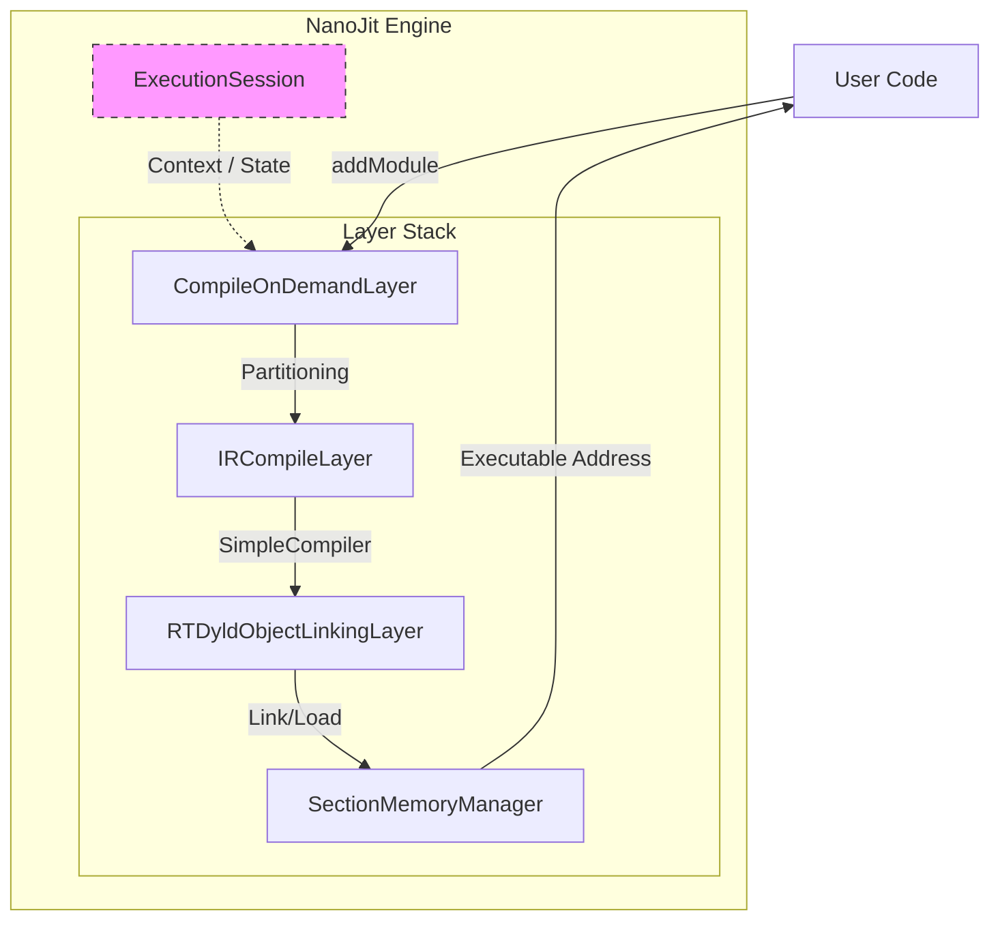

## NanoJit: High-Performance LLVM ORC JIT Engine

NanoJit is a lightweight, production-ready JIT compilation infrastructure built on top of
LLVM ORC v2 (On-Request Compilation). It is designed to serve as the dynamic code generation
backend for distributed query engines (e.g., Presto, Velox), providing a robust pipeline to
transform LLVM IR into executable machine code at runtime.

### 1. Architecture & Design

NanoJit abstracts the complexity of the raw LLVM ORC layer hierarchy into a cohesive Execution
Session Container. Its design focuses on resource isolation, lazy materialization, and strict
lifecycle management.

#### 1.1 The Compilation Pipeline

NanoJit constructs a specific layer stack designed for Lazy Compilation, ensuring that code is only
compiled when it is actually executed. This is critical for complex query plans where many generated
functions might never be called on specific data paths.



#### 1.2 Layer Hierarchy & Pipeline Implementation

NanoJit constructs a specific "Lazy Compilation" layer stack. Data flows from high-level IR to
executable memory through the following components:

1. `CompileOnDemandLayer` (The Lazy Gatekeeper)

- Implementation: This is the top-level layer. When `addModule()` is called, this layer does not
  compile the code. Instead, it extracts the function declarations and installs Stubs (trampolines)
  in the symbol table.
- Behavior: Compilation is triggered only when a function is called for the first time (via the stub).
  This significantly reduces startup latency for queries with many conditional branches.

2. `IRCompileLayer` (The Compiler)

- Implementation: Wraps `llvm::orc::SimpleCompiler`.
- TargetMachine Management: NanoJit explicitly owns the `TargetMachine` via `std::unique_ptr`.
  This is crucial because `SimpleCompiler` holds a reference to it, and the `TargetMachine` must
  outlive the compiler to avoid dangling pointer crashes (a common pitfall in LLVM 19+).

3. `RTDyldObjectLinkingLayer` (The Linker)

- Implementation: Uses `RuntimeDyld` to link generated Object Files into memory.
- Memory Management: Configured with a `SectionMemoryManager`, which allocates executable memory
  pages (RWX or RX) required for code execution.

4. `ExecutionSession` & `JITDylib`

- Session: The context holding string pools and global error states.
- JITDylib: Acts as a dynamic library symbol table. NanoJit configures a `DynamicLibrarySearchGenerator`
  to allow JIT-ed code to resolve symbols from the host process (e.g., calling `printf` or C++ runtime functions).

#### 1.3 Error Handling Strategy

- Initialization (Fail-Fast): Critical components (NativeTarget, Layer creation) use `llvm::cantFail`.
  If the environment is invalid (e.g., unsupported Arch), the process crashes immediately to prevent "Zombie Nodes" in a cluster.
- Runtime (Exceptions): `addModule` and `lookup` throw `std::runtime_error`. This ensures that a bad
  query (malformed IR) only fails the specific request, isolating the fault from the rest of the worker process.

### 2. Key LLVM Concepts for JIT

To effectively use NanoJit, it is essential to understand a few core concepts of LLVM IR (Intermediate
Representation). LLVM IR is a low-level, assembly-like language that is strongly typed.

#### 2.1 GEP (GetElementPtr)

"The Address Calculator"
`GetElementPtr` (often shortened to GEP) is one of the most misunderstood instructions in LLVM.

- What it does: It calculates a memory address based on a base pointer and a series of indices. It performs pointer arithmetic.
- What it does NOT do: It does not access memory. It does not read or write data. It purely computes `Base + Offset`.
- Example:
  If you have a struct `Row { int id; double score; }` (layout: `id` at offset 0, `score` at offset 4 or 8 depending on alignment).
  - `CreateStructGEP(rowPtr, 1)` effectively calculates: `address_of(rowPtr->score)`.
  - After the GEP instruction, you typically use a `Load` instruction to actually read the data at that address.

#### 2.2 SSA (Static Single Assignment) & PHI Nodes

"Handling Variables in Loops"
LLVM IR uses SSA form, meaning every virtual register (variable) is assigned exactly once. You cannot write `x = x + 1`. Instead, you create a new version: `x2 = x1 + 1`.

- The Problem: In a loop like `for(i=0; i<10; i++)`, the variable `i` changes value. How is this possible if variables are constant?
- The Solution (PHI Node): A `PHI` node is a special instruction used at the start of a basic block (like a loop header). It selects a value based on "where we came from".
  - Logic: "If we came from the `entry` block, `i` is 0. If we came from the `loop_body` block, `i` is `next_i`."
  - This allows loops to exist while maintaining the strict SSA property required for compiler optimizations.

#### 2.3 Basic Blocks (BB) & CFG

"The Flow of Execution"

- Basic Block: A sequence of instructions that executes straight through. It always ends with a Terminator instruction (e.g., `Ret` (return), `Br` (branch/jump)).
- CFG (Control Flow Graph): Functions are built by connecting Basic Blocks together using Branch instructions.
  - Example: An `if-else` statement typically creates three blocks: `if_true`, `if_false`, and `merge` (where execution continues).

#### 2.4 Module vs. Context

- LLVMContext: Holds global data such as type definitions and constant uniquing tables. It is not thread-safe.
- Module: A container for functions and global variables. It belongs to a Context.
- ThreadSafeContext: NanoJit uses this wrapper to allow multiple threads to generate IR simultaneously by giving each thread its own locked context context.

### 3. Singleton Manager: JitManager

The `JitManager` class provides a thread-safe, global access point to the JIT engine.

#### 3.1 Design & Implementation

- Pattern: Meyers' Singleton.
- Thread Safety: Uses `std::call_once` and `std::once_flag` to ensure initialization happens exactly once, even under high concurrency.
- Initialization Logic:
  1. `InitializeNativeTarget()`: Sets up the target architecture (e.g., AArch64, X86).
  1. `InitializeNativeTargetAsmPrinter()`: Enables assembly printing (required for code emission).
  1. `NanoJit::create()`: Instantiates the engine.
     This design ensures that the heavy lifting of LLVM target initialization occurs only on the first use, keeping the application startup fast.

### 4. Implementation Scenario: jit_sum (Expression Evaluation)

This module demonstrates how to JIT-compile mathematical expressions for different data types, simulating a SQL projection or aggregation scenario.

#### 4.1 IR Generation Details

The code uses `IRBuilder` to generate three distinct functions:

1. Integer Arithmetic (`sum_int`):

- Signature: `i32 (i32, i32)`
- IR: Generates an `add` instruction.
- Use Case: Simple integer counters or ID manipulation.

2. Floating Point Arithmetic (`sum_double`):

- Signature: `double (double, double)`
- IR: Generates an `fadd` instruction.
- Use Case: Scientific calculations or financial metrics.

3. Struct Manipulation (`sum_struct`):

- Signature: `void (ComplexStruct*, ComplexStruct*, ComplexStruct*)`
- IR Logic:
  - Uses `CreateStructGEP` (GetElementPtr) to calculate memory offsets for fields `a` (int) and `b` (double).
  - Loads values from input pointers.
  - Performs mixed-type arithmetic.
  - Stores results back to the result pointer.
- Significance: Demonstrates ABI compatibility between JIT-compiled code and host C++ structs.

### 5. Implementation Scenario: jit_sort (Algorithmic Logic)

This module demonstrates compiling complex control flow (loops, branches) to perform an in-memory Bubble
Sort on a dataset. This simulates a custom operator or UDF (User Defined Function) in a database engine.

#### 5.1 Data Structure

The JIT engine interacts with a C++ struct:

```C++
struct Row {
  int id;      // Primary Sort Key
  double score; // Secondary Sort Key
};

```

#### 5.2 IR Generation Logic (createBubbleSortModule)

The implementation manually constructs the Control Flow Graph (CFG) for the algorithm:

1. Basic Blocks:

- `entry`: Function entry.
- `loop_outer_cond` / `loop_outer_body`: Controls the `i` loop.
- `loop_inner_cond` / `loop_inner_body`: Controls the `j` loop.
- `swap` / `noswap`: Conditional execution based on comparison.

2. PHI Nodes:

- Uses `CreatePHI` to manage loop variables (`i` and `j`). This is essential in SSA (Static Single Assignment) form to handle variable updates across loop iterations.

3. Comparison Logic (`createCompare`):

- Implements a multi-key comparator.
- First compares `id`. If equal, compares `score`.
- Uses `CreateSelect` to implement the conditional logic without branching (branchless optimization for the comparator itself).

4. Memory Access:

- Calculates array offsets using `CreateGEP`.
- Swaps elements by loading all fields into registers and storing them back to swapped addresses.

#### 5.3 Execution Flow

1. Host C++ code creates a `std::vector<Row>`.
1. `NanoJit` compiles the `my_sort` function.
1. Host calls `lookup` to get the function pointer `void (*)(Row*, int)`.
1. The JIT-compiled machine code modifies the host memory directly, sorting the vector in place.

### 6. How To Integration

```C++
#include "nano_jit.h"
#include "llvm/IR/IRBuilder.h"
// ... include other LLVM IR headers ...

using namespace nano_jit;
using namespace llvm;
using namespace llvm::orc;

void executeJitTask() {
    // 1. Get the JIT Instance
    auto& jit = JitManager::get();

    // 2. Create Module & Context (ThreadSafe)
    auto tsCtx = std::make_unique<ThreadSafeContext>(std::make_unique<LLVMContext>());
    auto module = std::make_unique<Module>("MyModule", *tsCtx->getContext());
    
    // ... (Populate Module with IRBuilder) ...

    // 3. Add to JIT (Transfer ownership)
    try {
        jit.addModule(ThreadSafeModule(std::move(module), std::move(*tsCtx)));
        
        // 4. Lookup and Execute
        auto funcPtr = jit.lookup<int (*)(int)>("my_compute_function");
        int result = funcPtr(42);
        
    } catch (const std::exception& e) {
        // Handle runtime failure (query specific)
        std::cerr << "JIT Error: " << e.what() << std::endl;
    }
}

```

#### Deep Dive the Internals
This section provides a microscopic analysis of the implementation. We will dissect the memory management in `NanoJit` and the specialized code generation strategy in `jit_comparator`.

##### 6.1 src/nano_jit.cpp: The Engine Core
The `NanoJit` class acts as the operating system for our generated code. It manages memory, permissions, and
symbol tables.

A. The Factory (`NanoJit::create`) - Setting the Stage
Before we can compile anything, we must describe the "World" to LLVM.
```C++
// [nano_jit.cpp]
std::unique_ptr<NanoJit> NanoJit::create() {
    // 1. Initialize Native Target (Once per process)
    // This registers the CPU architecture (e.g., x86_64, AArch64) so LLVM knows
    // how to generate machine code for the current host.
    static std::once_flag initFlag;
    std::call_once(initFlag, []() {
        InitializeNativeTarget();
        InitializeNativeTargetAsmPrinter();
    });

    // 2. ExecutorProcessControl (EPC): "Who am I?"
    // We use SelfExecutorProcessControl because we are JITing into our OWN process.
    auto executorProcessControl =
        cantFail(SelfExecutorProcessControl::Create(std::make_shared<SymbolStringPool>()));

    // 3. JITTargetMachineBuilder (JTMB): "What hardware is this?"
    // Uses the triple from EPC to configure CPU features and alignment.
    JITTargetMachineBuilder jitTargetMachineBuilder(
        executorProcessControl->getTargetTriple());

    // 4. DataLayout (DL): "How big is a pointer?"
    // The DL defines endianness and pointer size. This is CRITICAL for
    // calculating struct offsets correctly in the IR.
    auto dataLayout =
        cantFail(jitTargetMachineBuilder.getDefaultDataLayoutForTarget());

    return std::unique_ptr<NanoJit>(new NanoJit(...));
}
```

B. The Constructor - Wiring the Pipeline
The layer stack is built from Bottom (Execution) to Top (Source).

```C++
// [nano_jit.cpp]
NanoJit::NanoJit(...) {
    // 1. Object Layer: The "Loader"
    // When compilation finishes, we have a blob of bytes (Object File).
    // This layer asks the OS for memory pages (mmap) that are Writable and Executable.
    objectLayer_ = std::make_unique<RTDyldObjectLinkingLayer>(
        *this->executionSession_,
        []() { return std::make_unique<SectionMemoryManager>(); });

    // 2. IR Compile Layer: The "Compiler"
    // Wraps SimpleCompiler, which runs the actual LLVM CodeGen passes (Instruction Selection,
    // Register Allocation) to turn IR into an Object File.
    auto compiler = std::make_unique<SimpleCompiler>(*targetMachine_);
    compileLayer_ = std::make_unique<IRCompileLayer>(
        *this->executionSession_, *objectLayer_, std::move(compiler));

    // 3. Compile On Demand Layer: The "Lazy Gatekeeper"
    // This layer intercepts addModule calls. It partitions the module and installs
    // stubs. Compilation is only triggered when a function is first called.
    compileOnDemandLayer_ = std::make_unique<CompileOnDemandLayer>(
        *this->executionSession_,
        *compileLayer_,
        *this->lazyCallThroughManager_,
        std::move(indirectStubsManagerBuilder));
}

```

##### 6.2 src/jit_comparator.cpp: Runtime Specialization
This file demonstrates the true power of JIT: Meta-Programming. We use C++ logic to generate a specialized
LLVM IR function that is hardcoded for a specific schema.
A. The "Meta-Loop" (Codegen Time)
The `createBoolCompareModule` function iterates over the sort keys. This loop runs once when the query starts,
not for every row.

```C++
// [jit_comparator.cpp]
// This loop unrolls the comparison logic.
// If we have 3 keys, we generate 3 blocks of linear IR code.
for (size_t i = 0; i < keys.size(); ++i) {
    const auto& key = keys[i];
    const auto& colInfo = schema[key.columnIndex];

    // Optimization: Hardcoded Offsets
    // Instead of reading an offset array at runtime, we bake the integer directly
    // into the GetElementPtr (GEP) instruction.
    auto* fieldPtrA = builder.CreateConstInBoundsGEP1_32(
        Type::getInt8Ty(context), baseA, colInfo.offset);

```

B. Branch Elimination (Type & Direction)
The generated machine code contains no logic to check data types or sort direction. That decision was made during the C++ execution of the generator.
```C++
    // [jit_comparator.cpp]
    Value* condTrue = nullptr;

    // The "if" checks happen at Codegen Time.
    // The generated IR will contain ONLY the specific instruction needed.
    if (colInfo.type == JITType::DOUBLE) {
        // Floating Point Logic
        if (key.isAscending) {
            // ASC: Generate FCmpOLT (Ordered Less Than)
            // "Ordered" means NaN < X is False.
            condTrue = builder.CreateFCmpOLT(valA, valB);
        } else {
            // DESC: Generate FCmpOGT (Ordered Greater Than)
            condTrue = builder.CreateFCmpOGT(valA, valB);
        }
    } else {
        // Integer Logic
        // ...
    }

```

C. The Cascade (Control Flow) The generated function implements a short-circuiting cascade.
```C++
    // 1. Check if A strictly precedes B (e.g., A < B).
    // If true, jump to retTrueBlock (return true).
    builder.CreateCondBr(condTrue, retTrueBlock, checkInverseBlock);

    // 2. Check if B strictly precedes A (e.g., B < A).
    // If true, jump to retFalseBlock (return false).
    builder.CreateCondBr(condFalse, retFalseBlock, nextKeyBlock);

    // 3. If neither, they are equal.
    // Fallthrough to nextKeyBlock to compare the next column.

```
