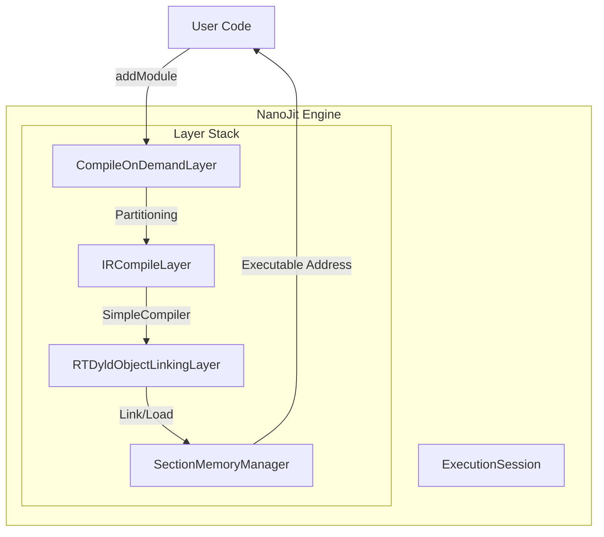

## NanoJit: High-Performance LLVM ORC JIT Engine
NanoJit is a lightweight, production-ready JIT compilation infrastructure built on top of
LLVM ORC v2 (On-Request Compilation). It is designed to serve as the dynamic code generation
backend for distributed query engines (e.g., Presto, Velox), providing a robust pipeline to
transform LLVM IR into executable machine code at runtime.

### 1. Architecture & Design
NanoJit abstracts the complexity of the raw LLVM ORC layer hierarchy into a cohesive Execution
Session Container. Its design focuses on resource isolation, lazy materialization, and strict
lifecycle management.

#### 1.1 The Compilation Pipeline
NanoJit constructs a specific layer stack designed for Lazy Compilation, ensuring that code is
only compiled when it is actually executed. This is critical for complex query plans where many
generated functions might never be called on specific data paths.


#### 1.2 Layer Hierarchy & Pipeline Implementation
NanoJit constructs a specific "Lazy Compilation" layer stack. Data flows from high-level IR to
executable memory through the following components:

1. `CompileOnDemandLayer` (The Lazy Gatekeeper)
- Implementation: This is the top-level layer. When `addModule()` is called, this layer does not
compile the code. Instead, it extracts the function declarations and installs Stubs (trampolines)
in the symbol table.
- Behavior: Compilation is triggered only when a function is called for the first time (via the stub).
This significantly reduces startup latency for queries with many conditional branches.
2. `IRCompileLayer` (The Compiler)
- Implementation: Wraps `llvm::orc::SimpleCompiler`.
- TargetMachine Management: NanoJit explicitly owns the `TargetMachine` via `std::unique_ptr`.
This is crucial because `SimpleCompiler` holds a reference to it, and the `TargetMachine` must
outlive the compiler to avoid dangling pointer crashes (a common pitfall in LLVM 19+).
3. `RTDyldObjectLinkingLayer` (The Linker)
- Implementation: Uses `RuntimeDyld` to link generated Object Files into memory.
- Memory Management: Configured with a `SectionMemoryManager`, which allocates executable memory
pages (RWX or RX) required for code execution.
4. `ExecutionSession` & `JITDylib`
- Session: The context holding string pools and global error states.
- JITDylib: Acts as a dynamic library symbol table. NanoJit configures a `DynamicLibrarySearchGenerator`
to allow JIT-ed code to resolve symbols from the host process (e.g., calling `printf` or C++ runtime functions).
#### 1.3 Error Handling Strategy
- Initialization (Fail-Fast): Critical components (NativeTarget, Layer creation) use `llvm::cantFail`.
If the environment is invalid (e.g., unsupported Arch), the process crashes immediately to prevent "Zombie Nodes" in a cluster.
- Runtime (Exceptions): `addModule` and `lookup` throw `std::runtime_error`. This ensures that a bad
query (malformed IR) only fails the specific request, isolating the fault from the rest of the worker process.
### 2. Singleton Manager: JitManager
The `JitManager` class provides a thread-safe, global access point to the JIT engine.
#### 2.1 Design & Implementation
- Pattern: Meyers' Singleton.
- Thread Safety: Uses `std::call_once` and `std::once_flag` to ensure initialization happens exactly once, even under high concurrency.
- Initialization Logic:
    1. `InitializeNativeTarget()`: Sets up the target architecture (e.g., AArch64, X86).
    2. `InitializeNativeTargetAsmPrinter()`: Enables assembly printing (required for code emission).
    3. `NanoJit::create()`: Instantiates the engine.
       This design ensures that the heavy lifting of LLVM target initialization occurs only on the first use, keeping the application startup fast.
### 3. Implementation Scenario: jit_sum (Expression Evaluation)
This module demonstrates how to JIT-compile mathematical expressions for different data types, simulating a SQL projection or aggregation scenario.
#### 3.1 IR Generation Details
The code uses `IRBuilder` to generate three distinct functions:
1. Integer Arithmetic (`sum_int`):
- Signature: `i32 (i32, i32)`
- IR: Generates an `add` instruction.
- Use Case: Simple integer counters or ID manipulation.
2. Floating Point Arithmetic (`sum_double`):
- Signature: `double (double, double)`
- IR: Generates an `fadd` instruction.
- Use Case: Scientific calculations or financial metrics.
3. Struct Manipulation (`sum_struct`):
- Signature: `void (ComplexStruct*, ComplexStruct*, ComplexStruct*)`
- IR Logic:
    - Uses `CreateStructGEP` (GetElementPtr) to calculate memory offsets for fields `a` (int) and `b` (double).
    - Loads values from input pointers.
    - Performs mixed-type arithmetic.
    - Stores results back to the result pointer.
- Significance: Demonstrates ABI compatibility between JIT-compiled code and host C++ structs.

### 4. Implementation Scenario: jit_sort (Dynamic Comparator)
This module demonstrates one of the most powerful applications of JIT in database engines: Runtime
Specialization. It dynamically generates a highly optimized comparison function for `std::sort` based
on the query schema, eliminating the overhead of interpretation and branch misprediction found in
generic comparators.

#### 4.1 The Problem: Generic Comparator Overhead
In a typical query engine, sorting logic is determined at runtime (e.g., `ORDER BY col1 ASC, col2 DESC`).
A generic C++ comparator must:
1. Loop through a vector of sort keys.
2. Check the data type of each column (Int? Double?) inside the loop.
3. Check the sort direction (Ascending? Descending?) inside the loop.
4. Calculate memory offsets dynamically.
   This results in significant CPU overhead due to branch mispredictions and memory indirections.

#### 4.2 JIT Solution: Specialized Codegen
The `createBoolCompareModule` function generates a specialized function
signature: `bool compare(char* rowA, char* rowB)`. The generation process "bakes in" all schema
information, resulting in a flat, branch-free instruction stream.
Key Optimization Techniques:
1. Hardcoded Offsets (Immediate Values)
- Instead of looking up offsets from a schema array at runtime (`*(base + offsets[i])`), the JIT compiler calculates the exact byte offset during codegen.
- IR: `CreateConstInBoundsGEP1_32(..., offset)`
- Result: Generates efficient assembly like `mov eax, [rdi + 4]`.
2. Type Erasure & Branch Elimination
- The logic for handling data types (Int32 vs Double) and sort direction (ASC vs DESC) is executed at Compile Time (C++ generation phase).
- The generated machine code contains NO switches or branches for types or directions. It simply executes the specific comparison instruction required (e.g., `icmp slt` or `fcmp ogt`).
3. Strict Weak Ordering & NaN Handling
- Implements robust floating-point comparisons using LLVM's Ordered predicates (`FCmpOLT`, `FCmpOGT`).
- Behavior: If any operand is `NaN`, the comparison strictly returns `false`. This satisfies the stability requirements of `std::sort` without needing expensive `isnan()` checks.
4. Cascading Logic (Short-Circuiting)
- The generated code implements a highly efficient cascade:
  1. Check 1: Does Row A strictly precede Row B? (e.g., `A < B` for ASC). If yes, return `true`.
  2. Check 2: Does Row B strictly precede Row A? (e.g., `B < A` for ASC). If yes, return `false`.
  3. Fallthrough: If neither, the keys are equal; proceed to the next column immediately.
- This ensures that the CPU returns as early as possible, minimizing memory access for subsequent columns.

#### 4.3 Execution Flow
1. Schema Definition: The host defines the layout (e.g., `Int32` at offset 0, `Double` at offset 4) and sort keys (e.g., Key 0 ASC, Key 1 DESC).
2. Codegen: `NanoJit` compiles a specialized function named (e.g., `cmp_0a_1d`).
3. Integration: The host retrieves the function pointer via `lookup`.
4. Execution: The pointer is passed directly to `std::sort`. The standard library sorts the raw memory pointers using the JIT-compiled logic, achieving performance comparable to hand-written assembly.

### 5. How To Integration

```C++
#include "nano_jit.h"
#include "llvm/IR/IRBuilder.h"
// ... include other LLVM IR headers ...

using namespace nano_jit;
using namespace llvm;
using namespace llvm::orc;

void executeJitTask() {
    // 1. Get the JIT Instance
    auto& jit = JitManager::get();

    // 2. Create Module & Context (ThreadSafe)
    auto tsCtx = std::make_unique<ThreadSafeContext>(std::make_unique<LLVMContext>());
    auto module = std::make_unique<Module>("MyModule", *tsCtx->getContext());
    
    // ... (Populate Module with IRBuilder) ...

    // 3. Add to JIT (Transfer ownership)
    try {
        jit.addModule(ThreadSafeModule(std::move(module), std::move(*tsCtx)));
        
        // 4. Lookup and Execute
        auto funcPtr = jit.lookup<int (*)(int)>("my_compute_function");
        int result = funcPtr(42);
        
    } catch (const std::exception& e) {
        // Handle runtime failure (query specific)
        std::cerr << "JIT Error: " << e.what() << std::endl;
    }
}

```